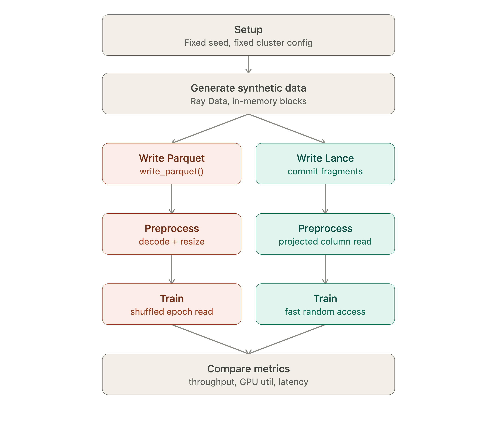

# Ray multimodal benchmark: Delta vs Lance

Measure how Ray Data + Ray Train perform when the underlying storage format is **Delta** (Parquet-backed, the Databricks-native default) vs **Lance**, across increasing scale (10k → 100k → 1M → 10M rows) of synthetic multimodal data (image + caption + embedding + metadata).

The comparison reflects the *real Databricks patterns* for each format, not a synthetic apples-to-apples:

- **Lance** stores image bytes **inline** in its blob layout.
- **Delta** stores an **`image_path`** reference; the JPEG files live in a UC Volume. This is how images are actually stored in Delta — a Delta row holding 100KB+ blobs inline is a config nobody runs at scale.

That difference *is* the benchmark. The Lance branch reads bytes directly; the Delta branch pays a per-image object-storage GET hop on every batch (README failure-mode #1 in the parent blueprint). The two **paved-path notebooks each write the same deterministically-generated source straight to its native format** — Delta path-refs (`01a`) and Lance fragments (`01b`) — so the comparison is one source → two terminal formats, diverging only where the formats genuinely differ. The Lance-native path is also the only one that avoids the per-image PUT storm the Delta path-ref pattern requires. RNG seed and cluster config are held constant.

> **Delta is Parquet underneath**, so the row-group mechanics still apply. "Delta" here means the UC-registered table + its Parquet files, read via `read_databricks_tables`.

## Notebooks

The paved path is `01a` → `01b` → `02` → `03`. `01a` and `01b` are independent — each generates its own copy of the identical (seeded) source and writes it to one format; run both before `02`.

| Notebook | Description |
|----------|-------------|
| `01a_delta_native.ipynb` | Generate the synthetic dataset and write it natively to Delta: JPEG files in a UC Volume + a Delta path-reference table, then the Delta-side ETL backfill. |
| `01b_lance_native.ipynb` | Generate the **same** source and write it **straight to Lance fragments**, never landing per-image files — the ingest-at-source path (e.g. video frames → Lance). This is where Lance's small-file / PUT-count advantage shows. |
| `02_training_benchmark.ipynb` | Feed each format through Ray Train, capture data-loading and training throughput |
| `03_compile_results.ipynb` | (Placeholder) Compile the per-format metrics from `01a`/`01b`/`02` (and the optional appendix) into the cross-format comparison |
| `optional/01_lance_conversion.ipynb` | **Optional appendix.** For customers already on Delta path-refs: read the existing JPEG files back from the Volume and convert them to inline Lance, measuring the migration cost. Not part of the paved comparison. |

## Compute & connectors

- **Data generation + writes** (`01a`, `01b`, optional `01`) — Databricks Classic Compute, **8 worker nodes × 16 CPUs**. `01b` needs no SQL Warehouse (no Delta table).
- **Training** (`02`) — **4 × A10** GPUs (Ray Train DDP); scale to 8 for the 1M/10M tiers.
- **SQL Warehouse** — both `ray.data.write_databricks_table` and `ray.data.read_databricks_tables` route through a running SQL Warehouse. The notebooks provision-or-reuse a serverless warehouse with a short auto-stop, and accept a `warehouse_id` widget to pin an existing one.

## Pipeline overview

### 1. Setup

Fix the RNG seed and the Ray cluster config (node count, CPU/GPU per node, object store memory) once, and hold both constant across the Delta and Lance runs. This isolates the storage format as the variable under test.

### 2. Generate synthetic data (`01a` / `01b`)

Both paved-path notebooks produce the canonical dataset as an in-memory Ray Dataset (`ray.data.range(N).map_batches(generate_fn)`) using the **same fixed seed** — generation is seeded by `(SEED, id)`, so it's deterministic and independent of partitioning. Each notebook regenerates the identical bytes rather than sharing a materialized copy, then writes straight to its native format. Because the seed is shared, the two runs are directly comparable byte-for-byte.

Schema:

| Column | Type | Notes |
|--------|------|-------|
| `id` | int | |
| `image` | binary | Procedurally generated JPEG bytes, ~30–300KB |
| `caption` | string | Templated variable-length text |
| `embedding` | list\<float32\> | e.g. 512-dim, mimics a CLIP embedding |
| `category` | string | Low-cardinality categorical |
| metadata | numeric | A few numeric columns |

### 3. Write — Delta native (`01a`) / Lance native (`01b`)

Two paved-path write routes, one per format, each writing the same generated source natively:

- **Delta, native** (`01a`) — write the JPEG bytes out as files in a UC Volume, then `ds.write_databricks_table(...)` a metadata table whose `image_path` column references those files. This is the native path-reference pattern, and it inherently issues ~one object-store PUT per image.
- **Lance, native** (`01b`) — write **straight to Lance fragments**, never landing per-image files. Image bytes stored inline, emitted with a single driver-side commit. This exposes Lance's small-file / PUT-count advantage directly: ~one PUT per fragment (dozens) instead of one per image. The right pattern when you own the ingestion pipeline (e.g. decoding video frames from bucket storage).

Because `01a` writes N image files and `01b` writes ~fragments, the PUT-count gap is the headline structural difference — it's the same mechanism behind the per-image GET hop that separates the two at training time.

**Optional migration appendix** (`optional/01_lance_conversion.ipynb`) — for customers *already* sitting on Delta path-refs: read the existing JPEG files back from the Volume and convert them to inline Lance. This deliberately pays the per-image readback cost (so its write time is comparable to `01a`'s file-landing), answering the narrower *"should I convert my existing file dataset to Lance?"* It writes to a separate `synthetic_lance_convert_{size}` dataset so it never clobbers the paved `01b` output.

**Metrics to log:**

- Write throughput — rows/sec, MB/s (raw and on-disk/compressed bytes)
- On-disk size and compression ratio
- File/fragment count and average size
- Ray write-task count and achieved concurrency
- Peak worker memory during write
- Object-store PUT count if writing to S3/GCS (small-file cost)
- Retry/error counts (Lance's writer has built-in retry-with-backoff)

### 4. Preprocess — Delta / Lance

**Decision: keep decode/resize inline, not as a materialized ETL step.** Once images are decoded to fixed-size arrays, both formats are storing uniform tensors and you lose the variable-size-blob problem that's the actual reason to compare them. Decode/resize is fused into the read path (`read_databricks_tables` + per-image file read / `read_lance` → `.map_batches(transform)` → straight into training) — this also preserves per-epoch random augmentation, which a cached copy would freeze.

**A separate, real ETL benchmark** runs alongside each write (Delta's in `01a`, Lance's in `01b`): compute a derived column once and backfill it into the existing dataset. This is where Lance has a structural advantage — its data-evolution / `add_columns` support backfills a new column without rewriting existing data, where Delta's metadata table needs an `ALTER TABLE ADD COLUMN` + full backfill rewrite. Each notebook measures wall-clock and total bytes rewritten for its format and persists them to `artifacts/`.

**Metrics for the inline preprocessing step (both branches):**

- Decode/resize throughput (rows/sec) under full-column read vs projected/column-selective read (image + id only, skipping embedding/text)
- For Delta: the extra per-image Volumes GET hop that Lance's inline layout avoids
- CPU utilization on the transform actors

### 5. Train — Delta / Lance

Feed the (branch-specific) dataset through Ray Train via `iter_torch_batches`, with a shuffled/random-access read pattern per epoch — this is the pattern most likely to separate the two formats; a sequential full scan will look similar for both.

Run twice per branch: once with a no-op dummy model step (isolates pure data-loading throughput), once with a real small model (attributes the bottleneck between I/O and compute).

**Metrics to capture:**

- Samples/sec, both dummy-model and real-model runs
- GPU utilization % (the tell for data-starvation)
- Time-to-first-batch
- Per-batch latency distribution — p50/p95/p99, not just mean
- Epoch-to-epoch throughput variance under shuffle
- CPU utilization on preprocessing actors
- Ray object-store spill events / disk IOPS during shuffled reads
- Actor-pool utilization (saturated vs waiting on IO)

### 6. Compare metrics (`03`)

Aggregate all of the above per format, per scale tier (10k/100k/1M/10M) — pulling the write/ETL metrics from `artifacts/{delta,lance}_{size}.json` and the training throughput from `02` — and look specifically at where the two formats diverge — expected to be the per-image GET hop, projected-column reads, and shuffled random-access throughput, rather than raw sequential scan speed.

## Scale tiers

| Tier | Purpose |
|------|---------|
| **10k** | Correctness pass — does the pipeline run end to end, do reads round-trip identical rows |
| **100k** | Tuning pass — actor pool sizing, batch sizing, CPU- vs IO-bound diagnosis |
| **1M** | First tier with real object-store spill and distributed shuffle; row-group pruning (Delta) vs fragment-based random reads (Lance), and the per-image GET hop, should start to show a gap |
| **10M** | Full stress test (~1–3TB at 100–300KB/row); multi-node scaling, and the tier where Lance's incremental-append/versioning advantage is most visible if you simulate incremental ingestion rather than one big write |
